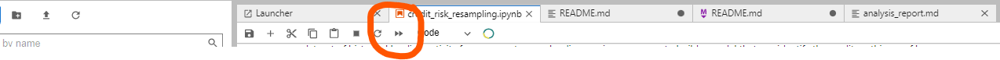
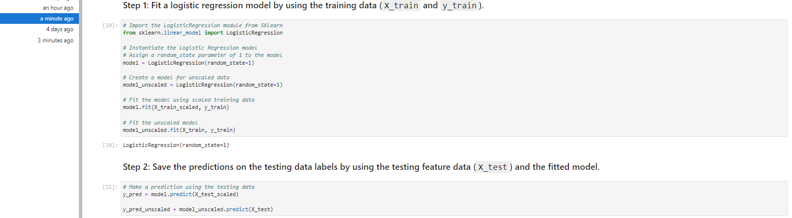
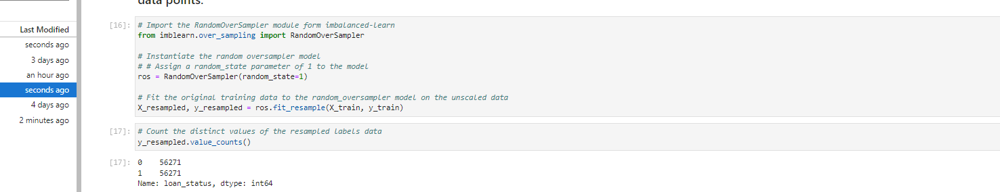

# Oversampling_Risky_Transactions
Utilizes oversampling on the minority split of a training dataset to create a more accurate machine learning model for high and low risk loan predictions.


---

## Technologies

Language: Python 3.9.12

Libraries used:

[Pandas](https://pandas.pydata.org/pandas-docs/stable/index.html) - For the creation and visualization of Data Frames

[Numpy](https://numpy.org/doc/stable/) - Fundamental package for scientific computing

[Jupyter Labs](https://jupyter.org/) - An ipython kernel for interactive computing in python

[Scikit-Learn](https://scikit-learn.org/0.18/auto_examples/svm/plot_iris.html) - Powerful machine learning library

[Imb-Learn](https://imbalanced-learn.org/stable/) - Utilizes resampling techniques to balance imbalanced data sets


---

## Installation Guide

If you are using an anaconda or a conda environment (which is highly recommended) chances are pandas, hvplot and jupyter labs are already installed in your virtual environment. In addition, installing Facebook's Prophet library will be necessary

For a full install activate a conda development environment and run in GitBash if not already installed, otherwise pip can be used:
```python
    conda install pandas
    conda install jupyterlab
    conda install -c pyviz hvplot
```

To install the other dependencies not included in the anaconda environment run:
```python
    conda conda install scikit-learn
    conda install -c conda-forge imbalanced-learn
```

Check the to make sure everything has been installed properly
```python
    conda list pandas
    conda list hvplot
    conda list jupyter lab
    conda list scikit-learn
    conda list imbalanced-learn
```

---

## Usage

To run this jupyter lab notebook you will need to use GitBash and navigate to where you have exported the files associated with this project and activate your dev environment.
Initiate jupyter lab on a local server by  using the command:

```python
    conda activate 'your-dev-environment'
    jupyter lab
```

Next, this project can be ran by navigating to the **credit_risk_resampling.ipynb** jupyter notebook file and clicking the double arrow as seen below:



This will run the jupyter notebook and each cell has proper pseudocode directing the viewer as to which analyses are being shown. Additionally, the markdown cells provided also clue the reader in to what is going on.

First, credit data is read into a data frame, split into training and testing data and used to fit a logistic regression model to predict credit risk. 

Next, the imbalanced data is resampled to have equally weighted testing and training sets by using random oversampling. The resampled data is used to fit a logistic regression model and used to predict credit risk.

The impact that resampling data to correct for imbalances in data sets can be seen in this analysis.


---

## Highlights:

### Coding Highlights

*Scaling and Predicting*



*Oversampling*


### Imbalanced Confusion Matrix


### Resampled Confusion Matrix


---

## Contributors

Created by Silvano Ross while in the UW FinTech Bootcamp
> Contact Info:
> email: silvanoross3@gmail.com |
> [GitHub](https://github.com/silvanoross) |
> [LinkedIn](https://www.linkedin.com/in/silvano-ross-b6a15a93/)


---

## License

[MIT](LICENSE)

